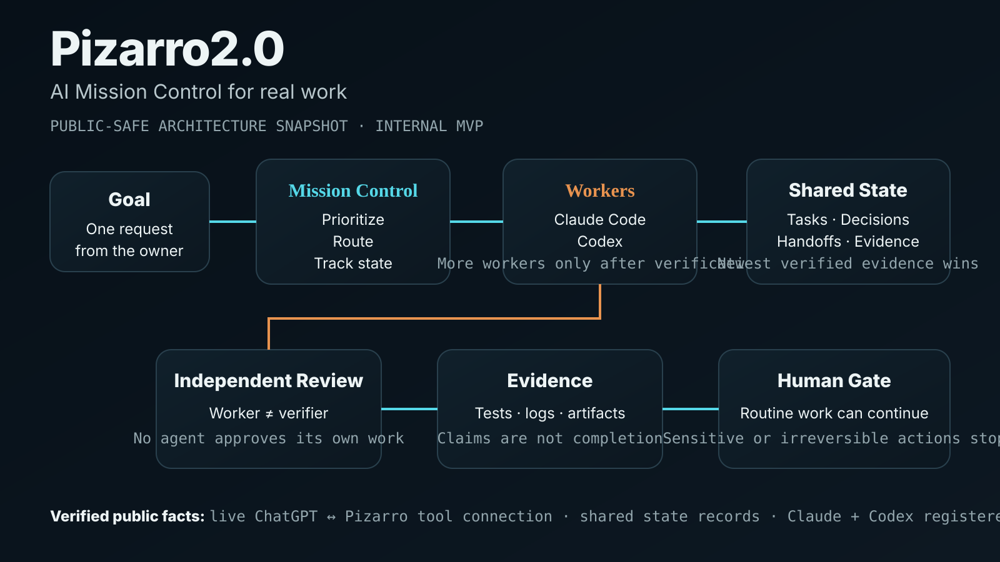

# Pizarro2.0 — Public Showcase

## What it is

Pizarro2.0 is an internal AI Mission Control prototype designed to coordinate multiple AI models and tools around real work.

The goal is not to make every AI autonomous. The goal is to make delegation **inspectable**:

**goal → routing → worker → independent review → evidence → human gate when needed**

## What is verified today

- ChatGPT can reach the Pizarro tool server through the connected tunnel.
- Shared operational state can store tasks, decisions, handoffs, and evidence.
- The committed Core worker registry currently contains Claude and Codex.
- Pizarro uses a standing rule that a worker does not approve its own work.
- The implementation repository, local paths, credentials, tunnel identifiers, and security-sensitive details remain private.

## Current status

**Internal MVP / active development.**

The next engineering work is the local mission queue and policy-gated runner needed to make safe routine execution more automatic.

## Public/private boundary

This page intentionally shows only the architecture and claims that are safe to disclose publicly. It does **not** publish:

- private source code from the orchestrator repository
- credentials, API keys, or account identifiers
- tunnel identifiers or local filesystem paths
- internal security controls
- private customer or personal data
- unsupported claims that the full autonomous system is finished

## Why it exists

Most AI tools can generate an answer. Pizarro2.0 is an experiment in coordinating AI systems so the work can be routed, checked, documented, handed off, and measured before it is treated as complete.
